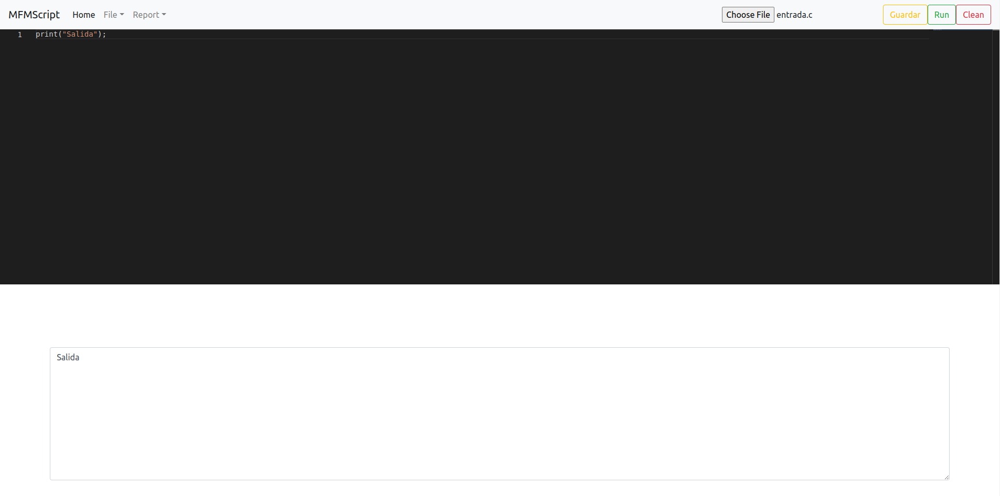
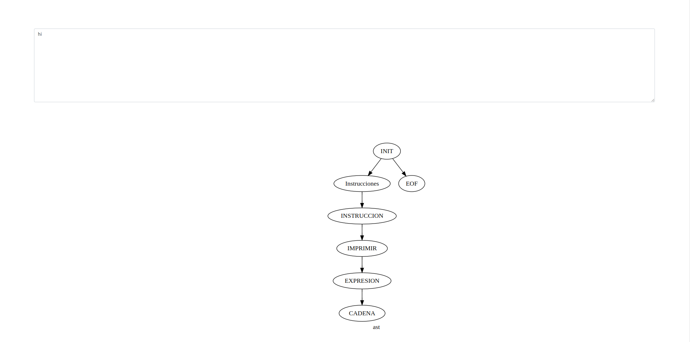

[comment]: # "Documentacion usuario del proyecto 2 de Organizacion de Lenguajes y Compiladores"

# MFMScript Manual de Usuario

## Tabla de contenido

- [Abstract](#abstract)
- [Compilador](#compilador)
  - [Estructura de un compilador](#estructura-de-un-compilador)
    - [Análisis](#análisis)
- [Sintaxis Pseudocodigo](#sintaxis-pseudocodigo)
  - [Conjunto de caracteres](#conjunto-de-caracteres)
  - [Palabras Reservadas](#palabras-reservadas)
  - [Operadores](#operadores)
  - [Comentarios](#comentarios)
  - [Declaración de variables](#declaración-de-variables)
  - [Asignación de variables](#asignación-de-variables)
  - [Tipos de datos](#tipos-de-datos)
    - [Carácter](#carácter)
    - [Número](#número)
    - [Cadena de caracteres](#cadena-de-caracteres)
    - [Boolean](#boolean)
  - [Condicionales](#condiconales)
    - [Condicional "Si"](#condicional-si)
    - [Selección múltiple](#selección-múltiple)
  - [Ciclos](#ciclos)
    - [Ciclo "Para"](#ciclo-para)
    - [Ciclo "Mientras"](#ciclo-mientras)
    - [Ciclo “Repetir hasta”](#ciclo-repetir-hasta)
  - [Retorno](#retorno)
  - [Método](#método)
  - [Funciones](#funciones)
  - [Llamada de funciones y métodos](#llamada-de-funciones-y-métodos)
- [Referencias](#referencias)

## Abstract

Este proyecto es un traductor de pseudocodigo a los lenguajes Python y Golang, utilizando como fundamentos las dos primeras fases del compilador el proyecto se realizo en el lenguaje Java con las herramientas JFlex y Cup.

**Palabras clave:** _Python, Golang, Java, JFlex y Cup_

---

## Compilador

Un compilador es un programa que puede leer un lenguaje (el lenguaje fuente) y traducilo en un programa equivalente en otro lenguaje (lenguaje destino).

### Estructura de un compilador

El compilador los podemos dividir en dos procesos el de analisis y el de sintesis, sin embargo para este proyecto solo nos enfocaremos en el proceso de analisis.

#### Análisis

Divide el programa fuente en componentes e impone una estructura gramaticas sobre ellas. De este proceso podemos obtener tres fases: analisis léxico, sintáctico y semántico.

Para este proyecto solo haremos uso del analisi lexico y sintactico.

**Análisis Léxico:**
El analizador léxico reconoce el flujo de caracteres que componene el programa fuente y los agrupa en secuencias significativadas, conocidas como _lexemas_.


**Análisis Sintáctico:**
El parser (analizador sintáctico) utiliza los primeros componentes de los tokens producidos por el analizador de léxico para crear una representación intermedia en forma de árbol que describa la estructura gramatical del flujo de tokens.

En estas dos fase se usa Jison.

## Sintaxis MFMScript

### Conjunto de caracteres

El conjunto basico de caracteres fuente de MFMScript incluye los caracteres:

- Letras minusculas y mayusculas del alfabeto latino basico: `a-aA-Z`
- Cifras decimales: `0-9`
- Caracteres graficos: `! " # % & ' ( ) * + , - . / : ; < = > ? [ \ ] ^ _ { | } ~`

### Palabras Reservadas

'int'     
'double'     
'boolean'     
'char'     
'string'     


/* Funciones nativas */
"print" 
"println" 
"typeof"      
'tolower'      
'toUpper'      
'tostring'      
'round'     

/* Condicionales */
"if"        
"else"        
'elif'         

/*Ciclos*/
"while"        
'for'         
'do'         
'until'         

/* incremento y decremento*/
"++"            
"--"            

/* Operaciones aritmeticas */
"+"     
"-"       
"*"     
"/"          
'^'          
'%'        
':'            

/* Operaciones relacionales */
'<='            
'>='            
">"           
'<'           
"=="      
'!='          

/*  */
'='             
/* Operadores Logicos */
'||'           
'&&'            
'!'             


";"          
"("           
")"             
"{"           
"}"           
","        

### Operadores

- aritmética: `+, -, *, /,%`
- asignación: `=`

- prueba de igualdad:` ==,!=`
- funciones de llamada: `( )`
- relaciones de orden : `<, <=, >,>=`
- secuenciación:,
  agrupación de subexpresiones :( )

| Operador          | Ejemplo                           |
| ----------------- | --------------------------------- |
| >                 | Expresion mayor Expresion         |
| <                 | Expresion menor Expresion         |
| >=                | Expresion mayor_o_igual Expresion |
| <=                | Expresion menor_o_igual Expresion |
| ==                | Expresion es_igual Expresion      |
| !=                | Expresion es_diferente Expresion  |

Operadores lógicos

| Operador | Ejemplo                 |
| -------- | ----------------------- |
| ||       | Expresion or Expresion  |
| &&       | Enpresion and Expresion |
| !        | not Expresion           |

### Comentarios

Esta instrucción puede estar en cualquier parte del archivo. Existen dos tipo de comentarios: de una línea y de dos o más líneas

Los comentario de una línea iniciaran con los caracteres “//”, el cual indicará que en adelante todos los caracteres serán considerados como comentarios y el fin del comentario estará delimitado por un salto de línea.

Los comentarios de más líneas estarán encerrados dentro de los caracteres “/_\*_” y “_\*_/”.

```C
//comentario de una línea

/* *******comentario
de más
líneas */

/* este también es un comentario */
```

### Declaración de variables

Esta instrucción permite ingresar variables dentro del flujo del código. Para ingresar el nombre se necesita reconocer la palabra reservada _“ingresar”_ y el tipo de dato. A continuación un ejemplo de una declaración:

```C
ingresar <nombre variable> como <tipo de dato> con_valor <expresión>;
```

Es posible realizar declaraciones múltiples, para ello es necesario ingresar una lista de nombres, separadas por comas.

```C
ingresar <lista de nombre> como <tipo de dato> con_valor <expresión>;
<lista de nombre>= <nombre1>, <nombre2>, <nombre3> …
```

Ejemplo para declarar un nombre de una variables.

```Java
myname_
lastname_
phone1_
phone2last_

```

### Asignación de variables

Esta instrucción cambia el valor de una variable determinada y la actualiza con el valor de una expresión, su estructura consta del nombre de la variable y una expresión.

```C++
<nombre variable> -> <expresión>;
```

Es posible realizar múltiples asignaciones de la siguiente forma: antes del carácter “`->`” se ingresa el nombre de las variables separadas por el carácter coma.

```C++
<nombre1> , <nombre2> , <nombre3> -> <expresión>;
```

### Tipos de datos

#### Carácter

Un carácter dentro de una comilla simple. Es posible ingresar el código ascii (únicamente se usarán los ascii de caracteres del alfabeto)

```C
'o'
'L'
'${70}'='F'
```

#### Número

1. Conjunto de dígitos que tienen una única vez el carácter punto dentro del conjunto de caracteres.
2. Conjunto de solo dígitos.

```C
10.02
11.1
56.0
105.152
4568
5
94
```

#### Cadena de caracteres

Conjunto de caracteres dentro de comillas dobles

```C
“Esta es una cadena”

“hola mundo”

“organización de
lenguajes y compiladores
1”
```

#### Boolean

Tipo de dato verdadero o falso.

```Python
Verdadero
Falso

```

### Condicionales

#### Condicional “Si”

Esta es una instrucción que permite ejecutar un bloque de instrucciones cuando una condición es válida. La instrucción necesita una condición para ejecutar un bloque asignado, cuando la condición es falsa se ejecuta otro bloque de instrucciones. Es posible que el bloque de instrucciones que ejecuta una condición falsa, sea opcional. Es **obligatorio** que ingrese una condición en esta instrucción.

```C++
//instrucción con bloque de instrucciones con condición verdadera
si <condición> entonces
    <instrucciones>
fin_si
//instrucción con bloque de instrucciones con condición verdadera y falsa
si <condición>
    <instrucciones>
de_lo_contrario
    <instrucciones>
fin_si
```

Caso especial: se usará la palabra reservada “`o_si`” cuando una condición es falsa y se trata de volver hacer otra validación con otra condición. Este tipo de ejecución puede ser opcional o repetirse una o muchas veces. A continuación se muestra un ejemplo de este caso especial

```C++
si <condición>
    <instrucciones>
o_si <condición_nueva> entonces
    <instrucciones>
de_lo_contrario
    <instrucciones>
fin_si

si <condición>
    <instrucciones>
o_si <condición_nueva> entonces
    <instrucciones>
o_si <condición_nueva> entonces
    <instrucciones>
de_lo_contrario
    <instrucciones>
fin_si
```

#### Selección múltiple

Este tipo de condición permite ejecutar una lista de instrucciones en base a un valor ingresado, existen varias opciones posibles y cuando el valor coincida con una de las opciones se ejecuta un conjunto de instrucciones. Existe una palabra reservada “`de_lo_contrario`” para ejecutar automáticamente cuando la lista de opciones no se cumple, pero es de forma opcional.

```C++
segun <valor> hacer
    ¿ <valor 1> ? entonces
        <instrucciones para valor 1>
    ¿ <valor 2> ? entonces
        <instrucciones para valor 2>
    ¿ <valor 3> ? entonces
        <instrucciones para valor 3>
    de_lo_contrario entonces
        <instrucciones por default>
fin_segun
```

Donde `<valor>` puede ser una variable o una expresión aritmética.

### Ciclos

Este tipo de instrucción permite realizar tareas repetitivas en base a una condición dada. Cada una de las instrucciones necesita de una condición de forma obligatoria.

#### Ciclo “Para--Sin Implementar”

Este ciclo ejecuta un conjunto de instrucciones, con un límite de repeticiones. Es necesario ingresar un _valor inicial_ y también un _valor final_, el valor final es el que le indica al ciclo, en momento para terminar de realizar las repeticiones. Otro de los elementos necesarios en este ciclo es el _número de pasos que realizará entre cada repetición_. Cuando el ciclo no tiene definido el número de pasos, se tomará como defecto el incremento en 1. Es posible que la lista de instrucciones esté vacía.

```C++
//Estructura de ciclo para con salto no definido
para <variable> -> <valor inicial> hasta <valor final> hacer
    <instrucciones>
fin_para

para <variable> -> <valor inicial> hasta <valor final> hacer
    //null
fin_para

//Estructura de ciclo para con salto definido
para <variable> -> <valor inicial> hasta <valor final> con incremental
    <valor del salto> hacer
        <instrucciones>
fin_para
```

Donde `<valor inicial>` y `<valor final>` puede ser considerado como el nombre de una _variable, un número o una expresión aritmética_.

#### Ciclo “While”

Este ciclo ejecuta un conjunto de instrucciones sin límite definido. Para poder realizar una repetición es necesario que exista una condición. Es posible que la lista de instrucciones esté vacía.

```C++
mientras <condicion> hacer
    <intrucciones>
fin_mientas

mientras <condicion> hacer
    //null
fin_mientas
```

#### Ciclo “Do While”

El ciclo o bucle Do-While, es una sentencia que ejecuta al menos una vez el conjunto de
instrucciones que se encuentran dentro de ella y que se sigue ejecutando mientras la
condición sea verdadera.

```Java
‘do’ ‘{‘
[<INSTRUCCIONES>]
‘}’ ‘while’ ‘(’[<EXPRESION>] ‘)’ ‘;’
```

_Ejemplo_

```Java
//Ejemplo de cómo se implementar un ciclo do-while
Int a=5;

do{
    if (a>=1 && a <3){
        Println(true);
    }
    else{
        Println(false);
    }
    a = a - 1;
} while (a>0);
/*RESULTADO
false false false true true */
```

#### Ciclo “Do Until”

Este ciclo aun tiene problemas.
Al igual que do while, do until ejecuta al menos una vez el codigo con la diferencia de que
el do while se ejecuta MIENTRAS la condicion se cumpla, caso contrario el do until se
ejecuta HASTA que la condicion se cumpla

```Java
‘do’ ‘{‘
[<INSTRUCCIONES>]
‘}’ ‘until’ ‘(’[<EXPRESION>] ‘)’ ‘;’

//Ejemplo de cómo se implementar un ciclo do-while Int a=5;
do{
    if (a>=1 && a <3){
        Println(true)
    }
    else{
        Println(false)
    }
    a--;
} until (a==0);
/*RESULTADO
false false false true true
*/
```

### Retorno

Esta instrucción está encargada de devolver un valor específicamente. Esta instrucción puede reconocer una `<condición>` , un número o una `<expresión aritmética>`.

```Java
retornar <expresión aritmética> ;
retornar <condición>;
retornar <número>;
```

### Método

Esta instrucción permite agrupar un conjunto de instrucciones y asignarles un nombre para identificarlo dentro del contenido del archivo. No necesita una instrucción de “Retorno” y si en caso es reconocido este tipo de instrucción, debe reportar dicho error.

```Java
metodo <nombre>
 <instrucciones>
fin_metodo
```

Es posible agregar parámetros al método, estos parámetros tendrá definido el tipo de dato y su respectivo nombre. Cada uno de los parámetros estará separado por un
carácter coma.

```Java
metodo <nombre> con_parametros (<lista de parametros>)
    <instrucciones>
fin_metodo

<lista de parametros> = <nombre> <tipo de dato> , <nombre> <tipo de dato> ,
<nombre> <tipo de dato> …
```

### Funciones

Esta instrucción permite agrupar un conjunto de instrucciones y asignarles un nombre para identificarlo dentro del contenido del archivo. Esta instrucción si es posible reconocer una instrucción de “Retorno'' en su estructura.

```Java
funcion <nombre> <tipo dato>
    <instrucciones>
fin_funcion
```

Es posible agregar parámetros a la instrucción, estos parámetros tendrá definido el tipo de dato y su respectivo nombre. Cada uno de los parámetros estará separado por un carácter coma.

```Java
funcion <nombre> <tipo dato> con_parametros (<lista de parámetros>)
    <instrucciones>
fin_funcion

<lista de parametros> = <nombre> <tipo de dato> , <nombre> <tipo de dato> ,
<nombre> <tipo de dato> …
```

### Llamada de funciones y métodos

Este tipo de instrucción realiza la ejecución de un método o función, para poder realizarlo es necesario ingresar el identificador de la función o método y la lista de parámetros necesarios.

```Java
//ejecutar sin parámetros
ejecutar <identificador>();

//ejecutar con parámetros
ejecutar <identificador>(<Lista de parámetros>);
```

En `<Lista de parámetros>` los parámetros están separados por el carácter
coma.

### Impresión

Esta instrucción muestra el contenido de una expresión o valor de una variable. Para poder utilizarla es necesario una expresión o valor de una variable. Al terminar de realizar la impresión se genera un salto de línea por defecto.

```Java
imprimir <expresión>; //impresión sin salto de línea
imprimir_nl <expresión>; //impresión con salto de línea
```

## Operaciones básicas

### Suma

Esta operación usa el carácter “+”

```Java
<Operando1> + <operando2>
```

### Resta

Esta operación usa el carácter “-”

```Java
<Operando1> - <operando2>
```

### Multiplicación

Esta operación usa el carácter “\*”

```Java
<Operando1> * <operando2>
```

### División

Esta operación usa el carácter “/”

```Java
<Operando1> /<operando2>
```

### Potencia

Esta operación usa la palabra reservada “potencia”

```Java
<Operando1> potencia [ <operando2> ]
```

### Módulo

Esta operación usa la palabra reservada “modulo”

```Java
<Operando1> mod <operando2>
```

### Paréntesis

Se usará para asociar un conjunto de operaciones aritméticas.

```Java
(<Conjunto de operaciones aritmeticas>)
```

## Empezando

### Clone este repositorio

```Bash
git clone https://github.com/OrmandyRony/OLC1--201807328-.git

```

### Ejecutando el programa

Se recomienda el uso de navegadores actualizados.
#### Iniciando



Pruebe cualquiera de los ejempos anteriores y de click en el boton run y vera una salida con su codigo ejecutado.



A la vez se deplegara un AST de una gramatica LR.


## Referencias

<dl compact="compact">
<dt>
<a name="dragonbook">[1]</a> 
</dt>
<dd>
A. Aho, R. Sethi, and J. Ullman, 
<i>Compilers: Principles, Techniques, and Tools</i>, 
Addison-Wesley Publishing,
Reading, MA, 
1986.
</dd>
</dl>

<dl compact="compact">
    <dt>
        <a name="manualcup" href="http://www2.cs.tum.edu/projects/cup/docs.php#intro">[2]</a> 
    </dt>
    <dd>
    <i> CUP User's Manual<i>
Michael Petter, Technische Universität München
Scott E. Hudson
Graphics Visualization and Usability Center
Georgia Institute of Technology
    </dd>
</dl>

<dl compact="compact">
    <dt>
        <a name="manualJFlex" href="https://www.jflex.de/manual.html">[3]</a> 
    </dt>
    <dd>
    <i> JFlex User’s Manual<i>
by Gerwin Klein, Steve Rowe, and Régis Décamps.
    </dd>
</dl>

<dl compact="compact">
    <dt>
        <a name="proyecto1">[4]</a> 
    </dt>
    <dd>
    <i>Proyecto 1,<i>
Universidad San Carlos de Guatemala
Facultad de Ingeniería
Escuela de Ciencias y Sistemas
Organización de Lenguajes y Compiladores 1
    </dd>
</dl>
